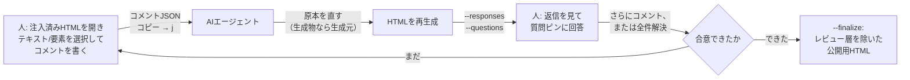

# samepage

*Get on the same page with your AI — literally.*

[English README is here](README.md)

## これは何か

samepage は、人とAIエージェントが同じHTMLドキュメントを見ながら意見をすり合わせるための、
後付け・着脱可能なレビュー層です。「AIが作って人が読むだけ」の一方通行ではなく、レビューを
往復にします。人はブラウザ上で表示されたページに直接コメントを書き、AIはそのフィードバックを
構造化JSONとして受け取り、**原本**に反映します。HTML自体が原本（手書きで、生成元を持たない）
なら、そのHTMLを直接直します。HTMLがMarkdownやMarp、intent-docのIRなどから生成された
成果物なら、生成元を直してHTMLを再生成します。HTMLだけを直しても次の再生成で消えるためです。
いずれの場合も、反映後に何をしたかを書き戻します。判断に迷う点があれば、AI側から人への逆質問を
同じページ上のピンとして立てることもできます。この往復は合意が取れるまで続き、合意後にレビュー層
を取り除いた、公開用のクリーンなHTMLを書き出します。

任意の静的HTMLに対して動作し、サーバー不要（すべて `file://` で完結）、実行時の追加依存も
ありません。人側に必要なのはブラウザとクリップボードだけです。

## 動作の流れ



- **人 → AI**: コメント。文字列の範囲・要素そのもの・要素間の挿入位置・SVG図中のノード・文書
  全体のいずれかに紐づけられる。1つの自己完結したJSONとして書き出し、そのままエージェントの
  チャットに貼れる。
- **原本か生成物かの見分け方**: 直す前に、`sourceHtml` の隣に同名の `.md` など生成元ファイルが
  あるか、HTML内に「Generated from ...」といった印がないかを確認する。
- **AI → 人**: 返信JSON（何を直した／見送った／そのままにしたか、その理由）。加えて、AI単独
  では判断しきれない点があれば、ページ上に直接質問ピンを立てて人の判断を求められる。
- **合意 → finalize**: 全コメントが解決済みになったら、`--finalize` でレビュー層と議論ブロック
  を取り除いた別ファイルの公開用HTMLを書き出す。これが実際に配布・公開する側。

## クイックスタート

```bash
git clone https://github.com/<your-account>/samepage.git
python3 samepage/samepage/cli.py your-doc.html --unit-selector body --label-format "Whole"
open your-doc.html            # または: start / xdg-open
```

ブラウザ側での操作:

1. テキストを選択して `a` キー（または💬ボタン）でコメントを追加。テキストの範囲ではなく
   要素そのもの・挿入位置・図のノードを指したいときは `e` キーで要素選択モードに入る。
2. `c` キーでコメントパネルを開閉、`j` キーで書き出しJSONをクリップボードにコピー。
3. そのJSONをコーディングエージェントのチャットに貼る。JSON自身が作業指示を内包しているため、
   説明を書き添えなくてもそのまま反映作業が伝わる。

## Claude Code スキルとして導入する

```bash
git clone https://github.com/<your-account>/samepage.git ~/.claude/skills/samepage
```

このパスにクローンしておけば Claude Code が自動的に認識する。「この資料にコメントできるように
して」「HTMLにレビュー機能をつけて」のように頼めば `samepage/cli.py` を自動で呼び出す。
実際の挙動（既定の注入方法・セレクタを調整すべき場面・JSONの契約・返信/質問の書き方・
finalizeの手順）は `SKILL.md` に定義されている。

## CLI リファレンス

```
python3 samepage/cli.py <input.html> [オプション]
```

| オプション | 説明 |
|---|---|
| `<input>` | 入力HTMLファイル（位置引数、必須） |
| `--unit-selector SEL` | コメントのラベル/連番を付ける「単位」要素のセレクタ（`tag` / `.class` / `#id` / `tag.class`）。省略すると単位ラベル付けをスキップ |
| `--label-format FMT` | ラベルのテンプレート。`{n}` が1始まりの連番に展開される。既定 `{n}` |
| `--doc-id ID` | JSON の `doc` フィールドと localStorage キーに使う識別子。既定は入力ファイルのstem |
| `--jump {scroll,hash}` | コメント一覧から単位要素へ飛ぶ方式。スムーススクロール、または `location.hash` を設定。既定 `scroll` |
| `--out PATH` | 出力先パス。既定は入力を直接上書き |
| `--responses PATH` | 埋め込む返信JSON（レビューコメントへの返信） |
| `--questions PATH` | 埋め込む質問JSON（質問ピン） |
| `--no-source-path` | `sourcePath` を絶対パスではなく `null` として埋め込む。配布物には必ず付ける |
| `--finalize` | レビュー層と議論ブロックを除いた公開用HTMLを別ファイルに書き出す。`--unit-selector`/`--responses`/`--questions` とは併用不可 |
| `--comments PATH` | finalize前に未解決（`open`）コメントの有無を確認するためのコメントJSON |
| `--force` | `--comments` が未解決を報告してもfinalizeを強行する |

既に注入済みのファイルに対して再注入すると、その場でレビュー層が置き換わる（冪等）。再注入時に
`--responses` / `--questions` のどちらも渡さないと、対応する層は消える（常に直近に注入した
内容だけが表示される仕様）。

## ターゲットの種類

コメント・質問のターゲットはそれぞれ `kind` を持つ。

| kind | 指す対象 | 主なフィールド |
|---|---|---|
| `text-range` | 選択された文字列の範囲 | `selectedText`, `contextBefore`, `contextAfter` |
| `element` | 要素そのもの | `path`（nth-of-typeチェーン）, `tag`, `nearText` |
| `insertion-point` | 要素の直前/直後の隙間 | `afterPath`, `beforePath`, `nearText`, `afterTag`, `beforeTag` |
| `diagram-node` | `data-sp-node` を振られたSVG図中のノード | `nodeId`, `nodeLabel`, `nearText` |
| `document` | 文書全体 | （なし） |

`path` や `nodeId` が一致しなくなったときのフォールバック順を含む、フィールドごとの詳細な
解決規則は `SKILL.md` §4 にある。

## ドキュメント生成側向け: SVG図をコメント対象にする

SVG図を埋め込むHTMLを生成する側は、図中の各ノードの意味的な `<g>` に属性を振ることで、
ノード単位で直接コメント可能にできる。

```html
<g data-sp-node="spec-07" data-sp-label="監査ログは追記のみ">
  <rect .../>
  <text>監査ログは追記のみ</text>
</g>
```

- `data-sp-node` は**その図を生成した元ソース側のノードIDと同一の安定ID**にする（IRのノードID
  や論理識別子など。レイアウト由来の連番 `g1`, `g2`... にはしない）。これによりレイアウトが
  変わる再生成を経てもIDが生き残る。
- `data-sp-label` にはノードの表示名を入れる。IDが変わったときのフォールバック解決と、パネル
  表示に使われる。
- エッジ（矢印）もクリック対象にしたい場合は、専用の `<g data-sp-node="...">` で包み、表示用の
  線に重ねて透明で太いヒットパスを描く。

公開用の出力に残したくない議論ブロック（検討中のメモ、案の比較など、レビュー中だけ必要な内容）
には `data-sp-discussion` を付ける。レビューが解決すれば `--finalize` がレビュー層とともに
これを除去する。

```html
<div data-sp-discussion>検討中のメモ。--finalize で除去される。</div>
```

完全な規約は `SKILL.md` §7.5 と §8 を参照。

## プライバシーに関する注意

既定では、注入されたページに `sourceHtml`（レビュー層を注入したファイルの絶対パス）が
埋め込まれる。これは、書き出したコメントJSONだけを受け取ったセッションでも対象ファイルを
特定できるようにするためのもの。HTML自体を配布する場合（READMEに添付する、自分のマシン外に
共有するなど）は `--no-source-path` を付け、このフィールドをローカルのファイルシステムパス
ではなく `null` として埋め込むこと。

## 開発

```bash
python3 -m pytest
```

ブラウザ駆動のテスト（`tests/test_browser.py`）は追加でPlaywright
（`pip install playwright && playwright install chromium`）が必要。Playwrightが無い環境では
自動的にスキップされる。

## ライセンス

MIT — `LICENSE` を参照。
