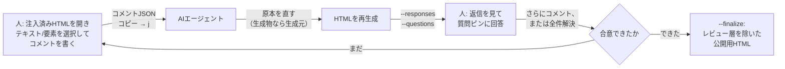

# samepage

*Get on the same page with your AI — literally.*

[English README is here](README.md)


*テキストや要素を選んでコメントし、`j` を押すだけで、JSONがそのままエージェントに渡る。
返信と質問ピンは同じページに戻ってくる。*

> デモに登場する「Release notes」は、本リポジトリ用に書かれた架空のサンプル文書です
> （`docs/demo/` および `tests/fixtures/` 配下のHTMLも同様）。実在の製品・プロジェクト・
> 組織を記述したものではありません。

## なぜ必要か

AIがHTML成果物を作った場合でも、レビューは結局チャット上で場所を説明して直してもらう形に
なりがちです。samepageは、人が表示されたページに直接コメントできるようにし、AIには構造化JSON
を渡して**原本**（HTMLが生成物なら生成元）を直させ、返信とAI自身の質問を同じページに書き戻します。
合意が取れたら、レビュー層を除いたクリーンな公開用HTMLを書き出します。

## これは何か

samepage は、人とAIエージェントが同じHTMLドキュメントを見ながら意見をすり合わせるための、
後付け・着脱可能なレビュー層です。「AIが作って人が読むだけ」の一方通行ではなく、レビューを
往復にします。人はブラウザ上で表示されたページに直接コメントを書き、AIはそのフィードバックを
構造化JSONとして受け取り、**原本**に反映します。HTML自体が原本（手書きで、生成元を持たない）
なら、そのHTMLを直接直します。HTMLがMarkdownやMarp、intent-docのIRなどから生成された
成果物なら、生成元を直してHTMLを再生成します。HTMLだけを直しても次の再生成で消えるためです。
いずれの場合も、反映後に何をしたかを書き戻します。判断に迷う点があれば、AI側から人への逆質問を
同じページ上のピンとして立てることもできます。この往復は合意が取れるまで続き、合意後にレビュー層
を取り除いた、公開用のクリーンなHTMLを書き出します。

任意の静的HTMLに対して動作し、サーバー不要（すべて `file://` で完結）、実行時の追加依存も
ありません。人側に必要なのはブラウザとクリップボードだけです。

## 動作の流れ



- **人 → AI**: コメント。文字列の範囲・要素そのもの・要素間の挿入位置・SVG図中のノード・文書
  全体のいずれかに紐づけられる。1つの自己完結したJSONとして書き出し、そのままエージェントの
  チャットに貼れる。
- **原本か生成物かの見分け方**: 直す前に、`sourceHtml` の隣に同名の `.md` など生成元ファイルが
  あるか、HTML内に「Generated from ...」といった印がないかを確認する。
- **AI → 人**: 返信JSON（何を直した／見送った／そのままにしたか、その理由）。加えて、AI単独
  では判断しきれない点があれば、ページ上に直接質問ピンを立てて人の判断を求められる。
- **合意 → finalize**: 全コメントが解決済みになったら、`--finalize` でレビュー層と議論ブロック
  を取り除いた別ファイルの公開用HTMLを書き出す。これが実際に配布・公開する側。

## 他の手段との比較

samepageはこれらを置き換えるものではありません。人がレンダリング済みの成果物をレビューし、AI
エージェントがそのレビュー結果を反映する必要がある場面のギャップを埋めるためのものです。

| | samepage | Google Docs / Notionのコメント | GitHub PRレビュー | Web注釈（Hypothesisなど） |
|---|---|---|---|---|
| コメント対象 | 任意の静的HTML、表示された状態そのまま | そのサービス自身のドキュメント | テキストの差分 | 任意のWebページ |
| サーバー・アカウント | 不要 | 必要 | 必要 | 必要 |
| AIへのフィードバック伝達 | 1つの自己完結したJSONをチャットに貼るだけ | 専用の連携がなければ手動コピー | 専用の連携がなければ手動コピー | 専用の連携がなければ手動コピー |
| AI→人への質問 | 同じページ上の質問ピン | コメント返信 | コメント返信 | コメント返信 |
| 修正の反映先 | 原本（生成物なら生成元） | ドキュメントそのもの | ドキュメントそのもの | — |
| 公開用出力 | `--finalize` でレビュー層を除去 | — | — | — |

## このREADME自体で試す

[`README.html`](README.html) は、このページをHTML化し、samepageのレビュー層をあらかじめ注入した
ものです（このツールを、このツール自身のドキュメントに適用したもの）。日本語版は
[`README.ja.html`](README.ja.html) です。

```bash
git clone https://github.com/hasimonasu/samepage.git
cd samepage
open README.ja.html   # または start / xdg-open。GitHubは.htmlをソース表示するのでローカルで開く
```

このREADMEの説明では足りない、あるいは自分の状況に合わせて書き直してほしい箇所があれば、
そこに直接コメントしてください。該当箇所を選択して `a` キー、要望を書く
（例:「コーディングエージェントを使ったことがない人向けに説明して」「この表を短くして」
「Windowsでの例を追加して」）。`j` キーでJSONをコピーし、cloneしたディレクトリで動いている
コーディングエージェントに貼れば、`README.md` を書き換えて回答し、HTMLを再生成します。
出来上がるのは、あなたが実際に抱いた疑問に沿って形を変えた、あなた専用のREADMEです。

## クイックスタート

```bash
git clone https://github.com/hasimonasu/samepage.git
cd samepage
python3 samepage/cli.py your-doc.html --unit-selector body --label-format "Whole"
open your-doc.html            # または: start / xdg-open
```

ブラウザ側での操作:

1. テキストを選択して `a` キー（または💬ボタン）でコメントを追加。テキストの範囲ではなく
   要素そのもの・挿入位置・図のノードを指したいときは `e` キーで要素選択モードに入る。
2. `c` キーでコメントパネルを開閉、`j` キー（またはパネルの「📋 Copy JSON」ボタン）で
   書き出しJSONをクリップボードにコピー。
3. そのJSONをコーディングエージェントのチャットに貼る。JSON自身が作業指示を内包しているため、
   説明を書き添えなくてもそのまま反映作業が伝わる。

## 動作要件

| 側 | 必要なもの |
|---|---|
| 注入する側（エージェント／開発者） | Python 3.9以上 — サードパーティ製パッケージは不要 |
| レビューする側（人） | `file://` のHTMLを開けるモダンブラウザ（Chrome, Firefox, Safari, Edge）とクリップボードへのアクセス。サーバー・拡張機能・アカウントは不要 |
| 任意 | Playwright — ブラウザテストとデモGIFの再生成に使用。Pillow — `docs/build_demo_gif.py` のみで使用。`markdown` パッケージ — `docs/build_readme_html.py` のみで使用 |

## Claude Code スキルとして導入する

```bash
git clone https://github.com/hasimonasu/samepage.git ~/.claude/skills/samepage
```

このパスにクローンしておけば Claude Code が自動的に認識する。リポジトリが
`.claude-plugin/plugin.json` を持っているため、このフォルダは `samepage@skills-dir` プラグイン
として読み込まれる。marketplace もインストール手順も不要で、**1回のクローンで2つのスキルが入る**。

| スキル | 用途 |
|---|---|
| `samepage` | 既存のHTMLにレビュー層を注入する。「この資料にコメントできるようにして」「HTMLにレビュー機能をつけて」 |
| `grill-on-samepage` | コードを書く前に設計を詰める。samepage の上でラウンド形式の面接を行い、合意した文書がプロジェクトのSSOTになる。「設計を詰めたい」 |

実際の挙動は `skills/samepage/SKILL.md` と `skills/grill-on-samepage/SKILL.md` に定義されている。

## CLI リファレンス

```
python3 samepage/cli.py <input.html> [オプション]
```

| オプション | 説明 |
|---|---|
| `<input>` | 入力HTMLファイル（位置引数、必須） |
| `--unit-selector SEL` | コメントのラベル/連番を付ける「単位」要素のセレクタ（`tag` / `.class` / `#id` / `tag.class`）。省略すると単位ラベル付けをスキップ |
| `--label-format FMT` | ラベルのテンプレート。`{n}` が1始まりの連番に展開される。既定 `{n}` |
| `--doc-id ID` | JSON の `doc` フィールドと localStorage キーに使う識別子。既定は入力ファイルのstem |
| `--jump {scroll,hash}` | コメント一覧から単位要素へ飛ぶ方式。スムーススクロール、または `location.hash` を設定。既定 `scroll` |
| `--out PATH` | 出力先パス。既定は入力を直接上書き |
| `--responses PATH` | 埋め込む返信JSON（レビューコメントへの返信） |
| `--questions PATH` | 埋め込む質問JSON（質問ピン） |
| `--no-source-path` | 注入したページの設定値 `sourcePath` を絶対パスではなく `null` として埋め込む。配布物には必ず付ける |
| `--finalize` | レビュー層と議論ブロックを除いた公開用HTMLを別ファイルに書き出す。`--unit-selector`/`--responses`/`--questions` とは併用不可 |
| `--comments PATH` | finalize前に未解決（`open`）コメントの有無を確認するためのコメントJSON |
| `--force` | `--comments` が未解決を報告してもfinalizeを強行する |

既に注入済みのファイルに対して再注入すると、その場でレビュー層が置き換わる（冪等）。再注入時に
`--responses` / `--questions` のどちらも渡さないと、対応する層は消える（常に直近に注入した
内容だけが表示される仕様）。

## ターゲットの種類

コメント・質問のターゲットはそれぞれ `kind` を持つ。

| kind | 指す対象 | 主なフィールド |
|---|---|---|
| `text-range` | 選択された文字列の範囲 | `selectedText`, `contextBefore`, `contextAfter` |
| `element` | 要素そのもの | `path`（nth-of-typeチェーン）, `tag`, `nearText` |
| `insertion-point` | 要素の直前/直後の隙間 | `afterPath`, `beforePath`, `nearText`, `afterTag`, `beforeTag` |
| `diagram-node` | `data-sp-node` を振られたSVG図中のノード | `nodeId`, `nodeLabel`, `nearText` |
| `document` | 文書全体 | （なし） |

`path` や `nodeId` が一致しなくなったときのフォールバック順を含む、フィールドごとの詳細な
解決規則は `skills/samepage/SKILL.md` §4 にある。

## ドキュメント生成側向け: SVG図をコメント対象にする

SVG図を埋め込むHTMLを生成する側は、図中の各ノードの意味的な `<g>` に属性を振ることで、
ノード単位で直接コメント可能にできる。

```html
<g data-sp-node="spec-07" data-sp-label="監査ログは追記のみ">
  <rect .../>
  <text>監査ログは追記のみ</text>
</g>
```

- `data-sp-node` は**その図を生成した元ソース側のノードIDと同一の安定ID**にする（IRのノードID
  や論理識別子など。レイアウト由来の連番 `g1`, `g2`... にはしない）。これによりレイアウトが
  変わる再生成を経てもIDが生き残る。
- `data-sp-label` にはノードの表示名を入れる。IDが変わったときのフォールバック解決と、パネル
  表示に使われる。
- エッジ（矢印）もクリック対象にしたい場合は、専用の `<g data-sp-node="...">` で包み、表示用の
  線に重ねて透明で太いヒットパスを描く。

公開用の出力に残したくない議論ブロック（検討中のメモ、案の比較など、レビュー中だけ必要な内容）
には `data-sp-discussion` を付ける。レビューが解決すれば `--finalize` がレビュー層とともに
これを除去する。

```html
<div data-sp-discussion>検討中のメモ。--finalize で除去される。</div>
```

完全な規約は `skills/samepage/SKILL.md` §7.5 と §8 を参照。

## プライバシーに関する注意

既定では、注入されたページにレビュー層を注入したファイルの絶対パスが埋め込まれる。これは、
書き出したコメントJSONだけを受け取ったセッションでも対象ファイルを特定できるようにするための
もの。このパスは2つの名前で登場するので混同しないよう注意してほしい。ページ内では埋め込み設定の
`sourcePath` キー、書き出したJSONではそこから写された `sourceHtml` フィールドで、どちらも実在し、
同じパスを保持している。

HTML自体を配布する場合（READMEに添付する、自分のマシン外に共有するなど）は `--no-source-path`
を付けること。`sourcePath` がローカルのファイルシステムパスではなく `null` として埋め込まれ、
書き出される `sourceHtml` も `null` になる。

## FAQ

**Q. HTMLファイルが原本なのか生成物なのか、どうやって見分ける？**
`sourceHtml` のパスの隣に同名の `.md` などの生成元ファイルがあるか、HTML内に「Generated
from ...」のような印がないかを確認します。原本ならそのHTMLを直接直し、生成物なら生成元を直して
再生成します（skills/samepage/SKILL.md §4 ルール1）。

**Q. HTMLを再生成したらコメントの `path` が一致しなくなった。コメントは失われる？**
失われません。`element` と `insertion-point` ターゲットには自動フォールバックがあります。`element`
は `path` が使えなければ `tag` + `nearText`（要素テキストの先頭60文字）で近い一致を探します。
`insertion-point` は `afterPath` から `afterTag`+`nearText` にフォールバックし、それも
失敗すれば `beforePath`/`beforeTag` 側から解決します。`diagram-node` は `nodeId` から
`nodeLabel`、さらに `nearText` の順にフォールバックします。詳細は skills/samepage/SKILL.md §4。

**Q. コメントはどこに保存される？**
ブラウザの `localStorage` に、キー `samepage:<doc>` で保存されます（ブラウザのプロファイル
ごと、どこにも同期されません）。書き出したJSONが唯一の永続的な記録であり、`--doc-id` でキーの
`<doc>` 部分を制御できます（既定は入力ファイルのstem）。

**Q. 既に注入済みのファイルにさらに注入するとどうなる？**
その場でレビュー層が置き換わります（冪等）。再注入時に `--responses` / `--questions` の
どちらか（または両方）を省略すると、対応する層は消えます（常に直近に注入した内容だけが
表示されます）。

**Q. SVG図中のノードにコメントできないのはなぜ？**
そのSVG図を生成した側が `data-sp-node` をノードに振っていないため。CLI側はこの属性を自動で
付与しません（意味的な単位を知っているのは生成側だけ）。上の「ドキュメント生成側向け」の節と
`skills/samepage/SKILL.md` §7.5 を参照してください。

**Q. `--finalize` が未解決コメントを理由に拒否する。どうすればいい？**
`--comments` にファイルを渡すと `open` の項目が報告されて中断します。レビュー側で解決するか、
`--force` を付けて強行します。finalize後の出力先は既定で `<stem>.final.html`（`--out` で
変更可能）。入力HTMLは変更されません。

## 開発

```bash
python3 -m pytest
```

ブラウザ駆動のテスト（`tests/test_browser.py`）は追加でPlaywright
（`pip install playwright && playwright install chromium`）が必要。Playwrightが無い環境では
自動的にスキップされる。ビルダーのテスト（`tests/test_alignment_builder.py`）も同様に、
`markdown` が無ければスキップされる。

生成物の再生成は以下:

```bash
pip install markdown
python3 docs/build_readme_html.py README.md README.html
python3 docs/build_readme_html.py README.ja.md README.ja.html
python3 samepage/cli.py README.html --unit-selector body \
    --label-format "Whole" --doc-id readme-en --no-source-path
python3 samepage/cli.py README.ja.html --unit-selector body \
    --label-format "全体" --doc-id readme-ja --no-source-path
for md in docs/alignment/*.md; do
    [ "$(basename "$md")" = "INDEX.md" ] && continue
    python3 docs/build_alignment_html.py "$md"
    python3 samepage/cli.py "${md%.md}.html" --finalize --out "${md%.md}.final.html"
done
python3 docs/build_alignment_html.py --index docs/alignment
```

CI はこれと同じ手順を実行し、生成物が古ければ fail する。`--no-source-path` は必須で、
付け忘れるとローカルの絶対パスがコミットされる。

## コントリビューション

Issue・PRは歓迎します。バグ報告には、注入前のHTML（または最小の再現手順）と、書き出した
コメントJSONを添付してください。

開発は `develop` ブランチで行います。`main` はリリースブランチで、マージはメンテナのみが行います。
PRは `develop` に対して開いてください。

PRを出す前に `python3 -m pytest` を実行してください（ブラウザテストはPlaywrightがインストール
されていれば実行され、なければスキップされます）。

命名（`sp-` というCSSプレフィックス、`data-sp-*` 属性、マーカーコメント）は固定であり、
`docs/design.md` を参照してください。

デモの再生成: `python3 docs/build_demo_gif.py`。

`README.html` / `README.ja.html` と `docs/alignment/` 配下のHTMLはgit管理下にあるため、生成元の
`.md` を変更したら再生成してください。コマンドは上の「開発」節のものをそのまま使ってください
（CI が突き合わせているのはこの手順です）。`--no-source-path` は必須で、付け忘れると自分の
マシンの絶対パスがコミットされるHTMLに焼き込まれます。

## クレジット

`grill-on-samepage` スキルの面接手法の語彙（design tree、frontier、ラウンド形式の質問、事実と
決定の分離）は、[mattpocock/skills](https://github.com/mattpocock/skills)（MIT）の `grilling`
スキルから借用しています。実装は独立に書いたもので、フォークではありません。

## ライセンス

MIT — `LICENSE` を参照。
