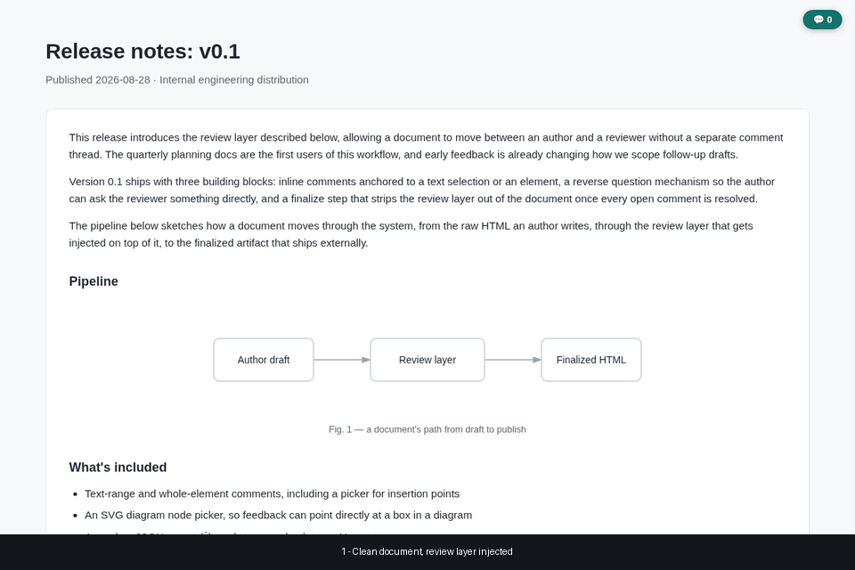
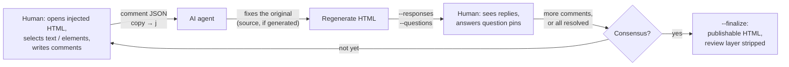

# samepage

*Get on the same page with your AI — literally.*

[日本語版 README はこちら](README.ja.md)




*Select text or an element, comment, press `j` — the JSON goes straight to your agent; replies
and question pins come back onto the same page.*

## Why

Even when an AI produces the HTML deliverable, "review" usually still means describing the
location in chat and asking for a fix. samepage lets the human comment directly on the rendered
page instead, and hands the AI structured JSON so it fixes the *original* (the source, if the
HTML is generated) and writes replies and its own questions back onto the same page. Once there
is consensus, a clean, publishable HTML with the review layer stripped is produced.

## What it is

samepage is a removable review layer that lets a human and an AI agent look at, and negotiate
over, the same HTML document. Instead of the usual one-shot "AI writes it, human reads it" flow,
samepage turns review into a back-and-forth: the human comments directly on the rendered page,
the AI receives that feedback as structured JSON, and applies it to the *original*. If the HTML
itself is the original — hand-written, with nothing it was generated from — the AI edits that
HTML directly. If the HTML is a generated artifact (built from a Markdown file, a Marp deck, an
intent-doc IR, and so on), the AI edits the source it came from and regenerates the HTML, since a
fix made only to the HTML is lost on the next regeneration. Either way, it writes back what it
did — including, when it isn't sure how to proceed, questions of its own for the human to answer
on the same page. The loop repeats until everyone agrees, at which point the review layer is
stripped out and a clean, publishable HTML is produced.

It works on any static HTML, requires no server (everything runs from `file://`), and adds no
runtime dependencies — a human only ever needs a browser and clipboard access.

## How it works



- **Human → AI**: comments, anchored to a text range, an element, an insertion point between
  elements, a node inside an SVG diagram, or the whole document. Exported as one self-contained
  JSON, pasted straight into the agent's chat.
- **Original vs. generated**: before editing, check whether this HTML is the original or a
  generated artifact — look for a same-named source file next to it (e.g. a `.md` beside the
  `sourceHtml` path), or for a "Generated from ..." marker inside the HTML itself.
- **AI → human**: a responses JSON (what was fixed / declined / left as-is, and why) and, when the
  agent needs a decision it can't make on its own, question pins that show up directly on the
  page for the human to answer.
- **Consensus → finalize**: once every comment is resolved, `--finalize` produces a separate,
  clean HTML with the review layer and any discussion blocks removed — the one you actually ship.

## How it compares

samepage isn't trying to replace these — it fills the gap where a human needs to review a
rendered artifact and an AI agent needs to act on that review.

| | samepage | Google Docs / Notion comments | GitHub PR review | Web annotation (Hypothesis etc.) |
|---|---|---|---|---|
| What you comment on | any static HTML, as rendered | the service's own documents | a text diff | any web page |
| Server / account | none | required | required | required |
| Handing feedback to an AI | one self-contained JSON, pasted into chat | manual copy or bot integration | manual copy or bot integration | manual copy or bot integration |
| AI → human questions | question pins on the same page | comment replies | comment replies | comment replies |
| Where fixes land | the original — the source, if generated | the document itself | the document itself | — |
| Publishable output | `--finalize` strips the layer | — | — | — |

## Quick start

```bash
git clone https://github.com/<your-account>/samepage.git
python3 samepage/samepage/cli.py your-doc.html --unit-selector body --label-format "Whole"
open your-doc.html            # or: start / xdg-open
```

Then, in the browser:

1. Select text and press `a` (or click 💬) to add a comment. Press `e` to pick an element, an
   insertion point, or a diagram node instead of a text range.
2. Press `c` to open the comment panel, `j` to copy the export JSON to the clipboard.
3. Paste that JSON into your coding agent's chat. It carries its own instructions, so a plain
   paste — with no extra explanation — is enough for the agent to act on it.

## Requirements

| Side | Needs |
|---|---|
| Injecting (agent / developer) | Python 3.9+ — no third-party packages |
| Reviewing (human) | A modern browser that opens `file://` HTML (Chrome, Firefox, Safari, Edge) and clipboard access. No server, extension or account |
| Optional | Playwright — only for the browser tests; the `markdown` package — only for `docs/build_readme_html.py` |

## Install as a Claude Code skill

```bash
git clone https://github.com/<your-account>/samepage.git ~/.claude/skills/samepage
```

Once cloned there, Claude Code picks it up automatically. Say things like "make this reviewable"
or "let people comment on this HTML" and it invokes `samepage/cli.py` for you — see `SKILL.md` for
the full behavior it follows (default injection, when to adjust the selector, the JSON contract,
how it replies and asks questions, and how it finalizes).

## CLI reference

```
python3 samepage/cli.py <input.html> [options]
```

| Option | Description |
|---|---|
| `<input>` | Input HTML file (positional, required) |
| `--unit-selector SEL` | Selector for "unit" elements comments attach a label/index to (`tag`, `.class`, `#id`, or `tag.class`). Omit to skip unit labeling |
| `--label-format FMT` | Label template; `{n}` expands to the 1-based ordinal. Default `{n}` |
| `--doc-id ID` | Document identifier used as the JSON `doc` field and the localStorage key. Default: the input file's stem |
| `--jump {scroll,hash}` | How the comment list jumps to a unit: smooth-scroll, or set `location.hash`. Default `scroll` |
| `--out PATH` | Output path. Default: overwrite the input in place |
| `--responses PATH` | Responses JSON to embed (replies to review comments) |
| `--questions PATH` | Questions JSON to embed (question pins) |
| `--no-source-path` | Embed `sourcePath` as `null` instead of an absolute path — use this for anything you distribute |
| `--finalize` | Write a publishable HTML with the review layer and discussion blocks removed, to a separate file. Cannot combine with `--unit-selector`/`--responses`/`--questions` |
| `--comments PATH` | Comments JSON checked for unresolved (`open`) items before finalizing |
| `--force` | Finalize even if `--comments` reports unresolved items |

Re-running injection on an already-injected file replaces the layer in place (idempotent). Passing
neither `--responses` nor `--questions` on a re-injection clears whichever of those layers was
previously embedded — only the most recently injected set is ever shown.

## Target kinds

Every comment or question target has a `kind`:

| kind | Points at | Key fields |
|---|---|---|
| `text-range` | A selected run of text | `selectedText`, `contextBefore`, `contextAfter` |
| `element` | An element itself | `path` (nth-of-type chain), `tag`, `nearText` |
| `insertion-point` | The gap right before/after an element | `afterPath`, `beforePath`, `nearText`, `afterTag`, `beforeTag` |
| `diagram-node` | A node inside an SVG diagram tagged with `data-sp-node` | `nodeId`, `nodeLabel`, `nearText` |
| `document` | The document as a whole | (none) |

Full field-by-field resolution rules, including fallback order when a `path` or `nodeId` no
longer matches, live in `SKILL.md` §4.

## For document generators

A generator that produces HTML with an embedded SVG diagram can make individual diagram nodes
directly commentable by tagging the semantic `<g>` for each node:

```html
<g data-sp-node="spec-07" data-sp-label="Audit log is append-only">
  <rect .../>
  <text>Audit log is append-only</text>
</g>
```

- `data-sp-node` must be the **same stable id used in the source that generated the diagram**
  (an IR node id, a logical identifier — not a layout-derived `g1`, `g2`, ...), so it survives
  regeneration even when the layout changes.
- `data-sp-label` should hold the node's display name, used as a fallback and shown in the panel.
- To make an edge/arrow pickable, wrap it in its own `<g data-sp-node="...">` together with a
  transparent, wide hit-path overlaying the visible line.

A discussion block that shouldn't survive into the published output — draft notes, an options
comparison, anything meant only for the review round — is tagged with `data-sp-discussion`. Once
the review is resolved, `--finalize` removes it along with the rest of the review layer:

```html
<div data-sp-discussion>Notes under discussion. Removed by --finalize.</div>
```

See `SKILL.md` §7.5 and §8 for the complete conventions.

## Privacy note

By default, the injected page embeds `sourceHtml` (the absolute path to the file the layer was
injected into) so a session that only receives the exported comment JSON can still find the file.
If you're distributing the HTML itself (attaching it to a README, sharing it outside your own
machine, etc.), pass `--no-source-path` so that field is embedded as `null` instead of a local
filesystem path.

## FAQ

**Q. How do I tell whether an HTML file is the original or a generated artifact?**
Look for a same-named source file next to it (e.g. a `.md` beside the path in `sourceHtml`), or
for a "Generated from ..." marker inside the HTML itself. If it's the original, edit the HTML
directly; if it's generated, edit the source and regenerate (SKILL.md §4, rule 1).

**Q. I regenerated the HTML and a comment's `path` no longer matches — is the comment lost?**
No. `element` and `insertion-point` targets fall back automatically: `element` falls back from
`path` to a nearby match using `tag` + `nearText` (the first 60 chars of the element's text);
`insertion-point` falls back from `afterPath` to `afterTag`+`nearText`, and if that also fails,
resolves from the `beforePath`/`beforeTag` side instead. `diagram-node` falls back from `nodeId`
to `nodeLabel`, then to `nearText`. See SKILL.md §4.

**Q. Where are comments stored?**
In the browser's `localStorage`, under the key `samepage:<doc>` — per browser profile, not synced
anywhere. The exported JSON is the durable record; `--doc-id` controls the `<doc>` part of that
key (default: the input file's stem).

**Q. What happens if I inject into an already-injected file?**
Re-running injection replaces the layer in place (idempotent). Omitting `--responses` and/or
`--questions` on a re-injection clears whichever of those layers was previously embedded — only
the most recently injected set is ever shown.

**Q. Why can't I comment on a node in my SVG diagram?**
Because the generator that produced the diagram hasn't tagged its nodes with `data-sp-node` — the
CLI never adds this attribute automatically; only the generator knows the semantic unit. See "For
document generators" above and `SKILL.md` §7.5.

**Q. `--finalize` refuses because of unresolved comments — what now?**
Pass a `--comments` file: it reports any `open` items and aborts. Either resolve them in the
review, or pass `--force` to finalize anyway. Finalized output defaults to `<stem>.final.html`
(override with `--out`); the input HTML is left unchanged.

## Development

```bash
python3 -m pytest
```

Browser-driven tests (`tests/test_browser.py`) additionally require Playwright
(`pip install playwright && playwright install chromium`); they're skipped automatically if
Playwright isn't available.

## Contributing

Issues and PRs are welcome. For a bug report, attach the pre-injection HTML (or a minimal repro)
and the exported comment JSON.

Development happens on `develop`; `main` is the release branch and is merged by the maintainer
only. Open PRs against `develop`.

Run `python3 -m pytest` before opening a PR (browser tests run when Playwright is installed,
otherwise they're skipped).

Naming (the `sp-` CSS prefix, `data-sp-*` attributes, marker comments) is fixed — see
`docs/design.md`.

To rebuild the demo: `python3 docs/build_demo_gif.py`. To rebuild the README HTML:
`python3 docs/build_readme_html.py README.md README.html`.

## License

MIT — see `LICENSE`.
